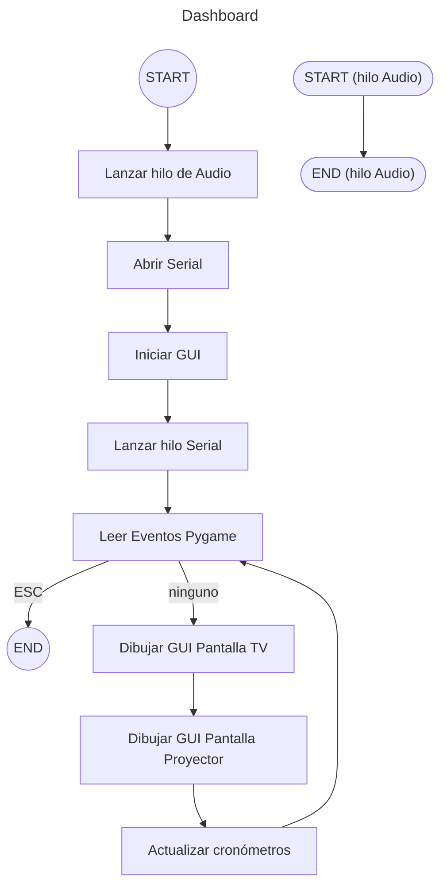
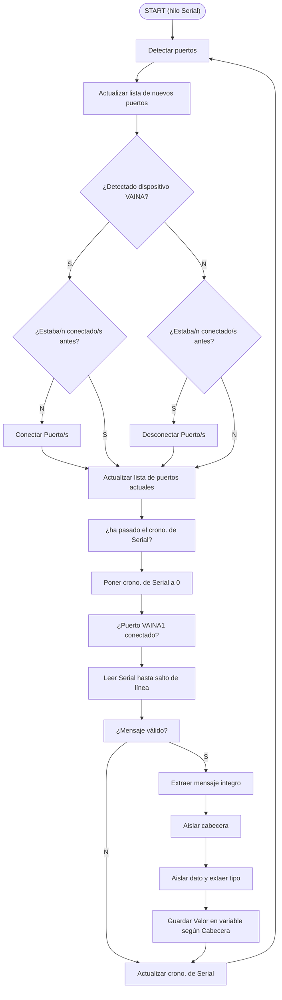

# VAINAS & DASHBOARD

'displayplacer' sctript has to be instlled for 'golem_autorun' to be able to fix the screen changing.
A copy v1.4.0 is kept in this repo, but the original might be found at https://github.com/jakehilborn/displayplacer.
 Following the instuctions, after download (brew is not an option due to an updated Xcode version) it has to be renamed to 'displyplacer' (if it is not its current name), granted execution permits with 'sudo chmod +x displyplacer', and moved to '/etc/'.

### Power-On routine
1. Plug in everything.
1. Turn on the projector and the screen.
2. Wait for the screen home-menu to load and set the right HDMI source (wher the computer is connected).
3. Turn on the computer and wait for the desktop to load.
4. In case the log-in screen shows up, input the credentials provided in the manual.

### Rutina de inicio

1. Force double disply setup: 
   ```
   /etc/displayplacer "id:5CEC9623-FB47-232A-34FD-A7D4190EF5A9 res:3840x2160 hz:30 color_depth:4 enabled:true scaling:off origin:(0,0) degree:0" "id:71BA247B-2026-6ACA-9E09-3CAC2D3F0E0B res:1280x1024 hz:75 color_depth:4 enabled:true scaling:off origin:(3840,0) degree:0"
   ``` 
2. Wait for some seconds (3).
3. Run the shell script that launches the python program:
   ```
   sh /Users/golem/Desktop/golem-node-screen/node_vaina-visualizer/runVisualizer.sh
   ```

4. (The python program is executed by the shell script):
   ```
   /usr/local/bin/python3 /Users/golem/Desktop/golem-node-screen/node_vaina-visualizer/main.py
   ```

### Diagrama de flujo 


